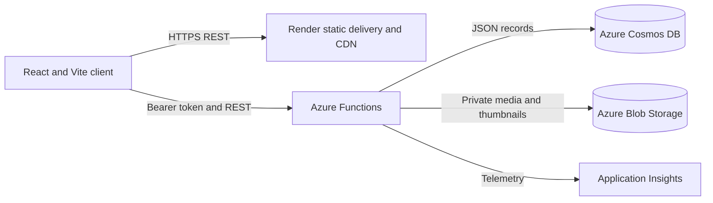

# kehindeScalableSolution

kehindeScalableSolution is a deployed, role-aware video platform developed for COM769 Coursework 2. Creator accounts publish governed video records; consumer accounts discover, play, comment on, like and rate that content without receiving upload permissions.

## Live Solution

- Frontend: <https://kehinde-scalable-solution.onrender.com>
- Azure Functions API: <https://kehinde-scalable-solution-api.azurewebsites.net/api>
- Source: <https://github.com/Goldpurp/kehindeScalableSolution>

## Architecture



The layers have separate scaling responsibilities:

- Render serves the immutable frontend build through HTTPS and edge caching.
- Azure Functions applies authentication, role checks, validation and service logic.
- Cosmos DB persists users, videos, comments, ratings, view identities and activities.
- Blob Storage stores private video and thumbnail objects outside the document database.
- Media responses support HTTP byte ranges so playback and seeking do not require every request to buffer a complete video.

## Implemented Requirements

- Email/password registration and sign-in with scrypt password hashing.
- Seven-day signed bearer tokens, resolved back to a current Cosmos DB user on protected requests.
- Public consumer registration and invitation-controlled creator enrolment.
- Creator-only upload and owner-only update/delete rules enforced by the API.
- Producer, publisher and ownership metadata derived server-side from the authenticated creator.
- Caption, genre and validated age-rating metadata.
- Latest-video dashboard, search, profiles and responsive mobile navigation.
- Persisted comments, likes, shares, unique consumer views, ratings and activity notifications.
- Consumer-only ratings; creators cannot rate uploaded content.
- Cursor-paged API requests with a maximum page size of 50.
- Private Blob objects streamed through cacheable byte-range API responses.
- GitHub Actions verification and automatic Render deployment from `main`.

## Local Verification

Prerequisite: Node.js 22.

```bash
npm ci
npm run verify
```

`npm run verify` performs the frontend type-check and production build, then compiles and runs the Azure Functions policy tests.

To run the frontend locally:

```bash
npm run dev
```

To run the optional non-destructive smoke test against a deployed API, set the environment variables documented in `.env.example`, then run:

```bash
npm run smoke:live
```

## Deployment

The frontend deployment is defined in `render.yaml`. Render installs from the lockfile, creates the production build and publishes `dist` whenever `main` changes.

Azure infrastructure is described in `backend/azure/infra/main.bicep`. It provisions:

- Azure Functions Consumption plan
- Cosmos DB account, database and four containers
- Storage account and private `videos` container
- Application Insights
- authentication and creator-invitation settings

Deployment evidence, limitations and the production roadmap are documented under `docs/` and `backend/azure/`.

## Coursework Evidence

- `docs/architecture-and-scalability.md`: design decisions, scale boundaries and alternatives.
- `docs/testing-evidence.md`: automated, build and live-smoke evidence.
- `docs/coursework-evidence-map.md`: rubric-to-evidence traceability.
- `docs/submission-checklist.md`: recording, embedding and final hand-in checks.
- `security_spec.md`: trust boundaries, abuse cases and enforced controls.
- `backend/azure/deployment-notes.md`: deployed resources and subscription limitations.
- `kehindeScalableSolution Presentation - Final.pptx`: assessment presentation in the parent folder.
